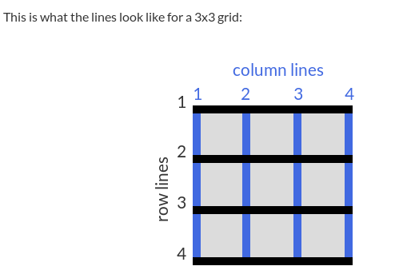

## Basics
* each item is encapsulated in a cell
* add columns to a container using **grid-template-columns**
* add rows to a container using **grid-template-columns**
* grid units:
  * **auto** (set the column/row to the size of the component)
  * **%** (set the column/row to the percent width of its container)
  * **px/em** (set the column/row to the fixed size in px/em)
  * **fr** (set the column/row to the fraction of the available space)
* add a column gap using **grid-column-gap**
* add a row gap using **grid-row-gap**

---
##### Divide the canvas in lines and span the element across the specified lines(from 1 to 3 in this case)

```CSS
grid-column: 1 / 3;
```
```CSS
grid-row: 1 / 3;
```
---

###### Cells properties
* allign horizontally the position in the cell using **justify-self** (accepted: *start*,*end*,*center*)
* allign vertically the position in a cell using **align-self** (same parameters accepted)

###### Container properties
* allign all items in a container using **justify-items** and **align-self**

---

##### Divide the grid into area templates
```CSS
grid-template-areas:
  "header header header"
  "advert content content"
  "footer footer footer";
```
-> top area is a header
-> bottom area is made up of two areas:  advert and content
-> bottom area is a footer
* everything between **""** is a row and every word represents a cell
* define an empty cell : **.**

###### Place an element in the custom area
```CSS
grid-area:header;
```
* Note: you can also use the lines if an area is not defined
```CSS
grid-area:3/1/4/4
```
(between the third and fourth horizontal lines and between the first and fourth vertical lines)


---

* create 100 rows that are 50px tall using **grid-template-rows:repeat(100,50px)**
* same applies for columns using **grid-tempalte-columns**
* create a column of a minimum/maximum size using **minmax(min_size, max_size)** 
* instead of using **repeat** and manually specifying how many columns/rows use replace the number passed to repeat with **auto-fill** 
* media queries can be used to  rearrange grid areas, change dimensions of a grid, and rearrange the placement of items