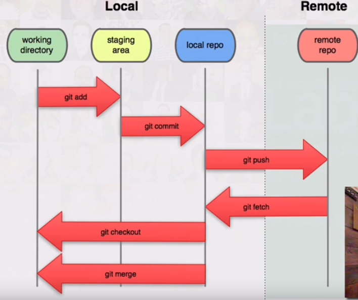

## Git
--> track changes of files over time

--> a big directed acyclic graph

### Basic commands

> git init

* initialise a repository

> git init example

* initialise a repository with the name "example"

> git status

* check the status of the repository

> git add test.md

* add the file to the staging area

> git rm test.md

* remote the file from the staging area

> git commit -m "My commit"

*

> git clone myrepo

* copy a repo to the current directory

> git pull -r

* get the new version from the repo and do rebase

> git mv

* rename a file and detect it automatically in the staging area

> git diff

* it compares the WORKING area with the STAGING area

> git diff --staged

* it compares the STAGING area with the REPO(the branch that you are currently on)

> git rm

* remove the file from the working area and add the deletion of it to the stagin area

> git rebase -i HEAD~4

* from where currently are, go back 4 commits(good for rewriting the history)

> git reflog

* like a version control for the version control
* can undo the rebase:

> git reset --hard HEAD@{n}

* take the current branch and put it back where it was 5 steps in it's history(in the reflog)

### Internals
--> a git repository is just the folder ".git"
--> ignored files can be specified in the ".gitignore" file
--> git does not stare the diff, but if make another copy of each object
--> storing the diff would mean that when you try to get the up to date version of a repo, all "n" commits would have to be computed while git only does O(1)
--> even tough you might have 2 versions of a file where only a line of code was changed, a compression algorithm is used to create .pac files

Working ---> Staging(git add)

Working <--- Staging(git reset)

Staging ---> Repo(git commit)

Working <--- Repo(git checkout)

--> objects stored by git:
* Blob(binary large objects)
  * contains the data itself(source code,image,video etc)
* Tree
  * pointer to file names, other trees
* Commit
  * author, message, pointer to a tree
* Tag

--> the "add" command creates Blob objects
--> the "commit" commands creates Tree and Commit objects
--> the "commit" command creates a snapshot of the entire project

--> see the content of an object(type just the shortest unique identifier - 8 characters usually)
> git show e7d8e73a....

> git show --pretty-print=raw e7d8e73

--> see the content of a tree objects
> git ls-tree f9e2e3ed....

--> a branch is a pointer to any commits in the repo

- [ ] after a file is deleted, how do you get it back from the repo?
